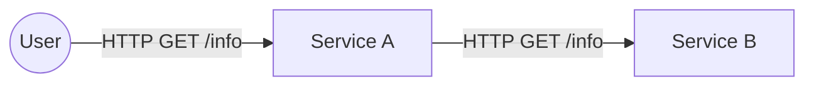

# Step 3 – Service-to-Service Communication

## Objectives

In this step, you will:

* Deploy two cooperating services: `service-a` and `service-b`
* Understand how **Service Discovery** works in Kubernetes (DNS)
* Observe how **Environment Variables** are used to configure services
* Verify that `service-a` can talk to `service-b` using its stable Service name

---

## Context: The Application Architecture

We are building a tiny distributed system:



* **Service A**: The "frontend" service (API gateway style). It calls Service B to enrich its response.
* **Service B**: A backend service.

Review the code in `services/day-1/service-a/server.js`:

```javascript
const response = await fetch("http://service-b:8080/info");
```

It hardcodes `http://service-b:8080`.
This works because Kubernetes provides **Cluster DNS** that resolves Service names to IP addresses.

---

## Step 3.1 – Build and Load Images

We need to build both images and load them into `kind`.

### Service A

```bash
cd services/day-1/service-a
docker build -t service-a:dev .
kind load docker-image service-a:dev
```

### Service B

```bash
cd ../service-b
docker build -t service-b:dev .
kind load docker-image service-b:dev
```

⚠️ **Don’t forget the `kind load` step.** If you forget it, Kubernetes will try to pull the image from Docker Hub and fail (ImagePullBackOff).

---

## Step 3.2 – Deploy to Kubernetes

Go back to the root of the repository.

```bash
cd ../../..
```

Apply the manifests:

```bash
kubectl apply -f k8s/day-1/service-a.yml
kubectl apply -f k8s/day-1/service-b.yml
```

Verify that both are running:

```bash
kubectl get pods
kubectl get services
```

You should see:

* 2 Pods (one for A, one for B)
* 2 Services (`service-a`, `service-b`)

---

## Step 3.3 – Test the Communication

We will access `service-a` from our laptop.

```bash
kubectl port-forward service/service-a 8080:8080
```

(If you still have an old port-forward running, stop it first).

Now, open another terminal and call the API:

```bash
curl http://localhost:8080/info
```

### What to Observe

The response should look like this:

```json
{
  "app": {
    "name": "service-a",
    "version": "dev"
  },
  "runtime": { ... },
  "serviceB": {
    "app": {
      "name": "service-b",
      "version": "dev"
    },
    ...
  }
}
```

If you see the `serviceB` section populated, it means:

1. Request went from **Your Laptop** → **Service A** (via port-forward)
2. **Service A** resolved `service-b` via Kubernetes DNS
3. Request went from **Service A** → **Service B**
4. Response travelled all the way back

This confirms that **Service Discovery** is working!

---

## Optional: Observe Load Balancing in Action

If we scale **Service B**, Service A should automatically balance traffic between instances.

1. **Scale Service B**:

   ```bash
   kubectl scale deployment service-b --replicas=3
   ```

2. **Wait for Pods to be ready**:

   ```bash
   kubectl get pods -w
   ```

3. **Generate Traffic** (via Service A):

   Call `service-a` multiple times:

   ```bash
   curl http://localhost:8080/info
   ```

   Look at the `serviceB.runtime.hostname` field in the JSON response.
   You should see it cycling through the different pod names of Service B.

---

## Key Takeaways

* **Service Discovery**: In Kubernetes, you don't need to know IP addresses. You use the **Service Name** as the hostname.
* **Separation of Concerns**: Service A doesn't know how many instances of Service B exist. It just calls the URL.
* **Stable endpoints**: Even if Service B pods die and are replaced, the DNS name `service-b` remains stable.
